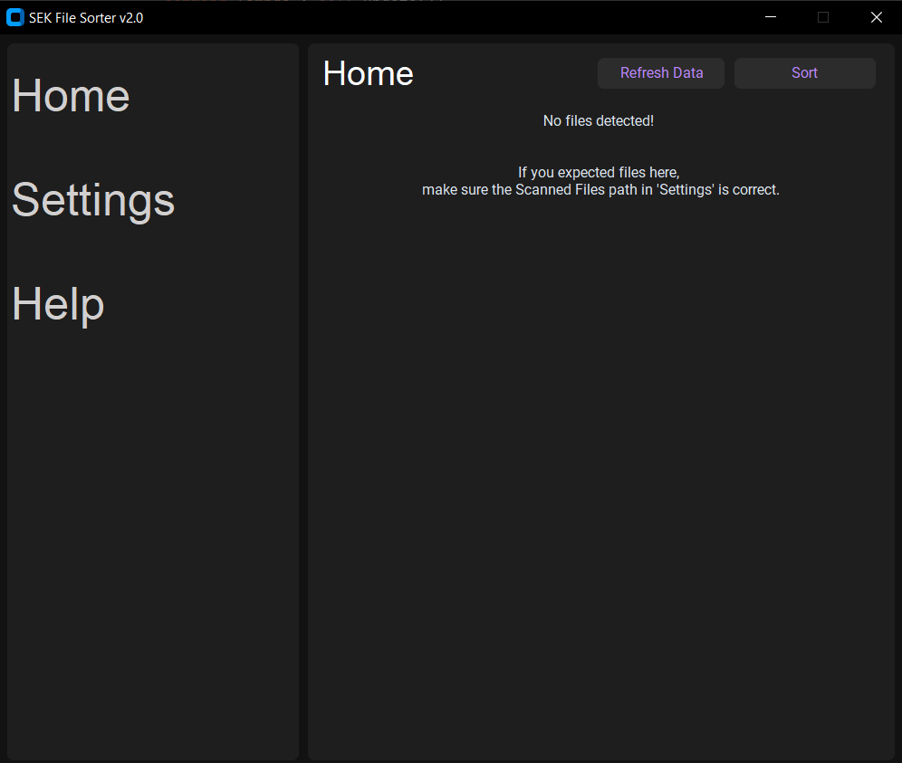
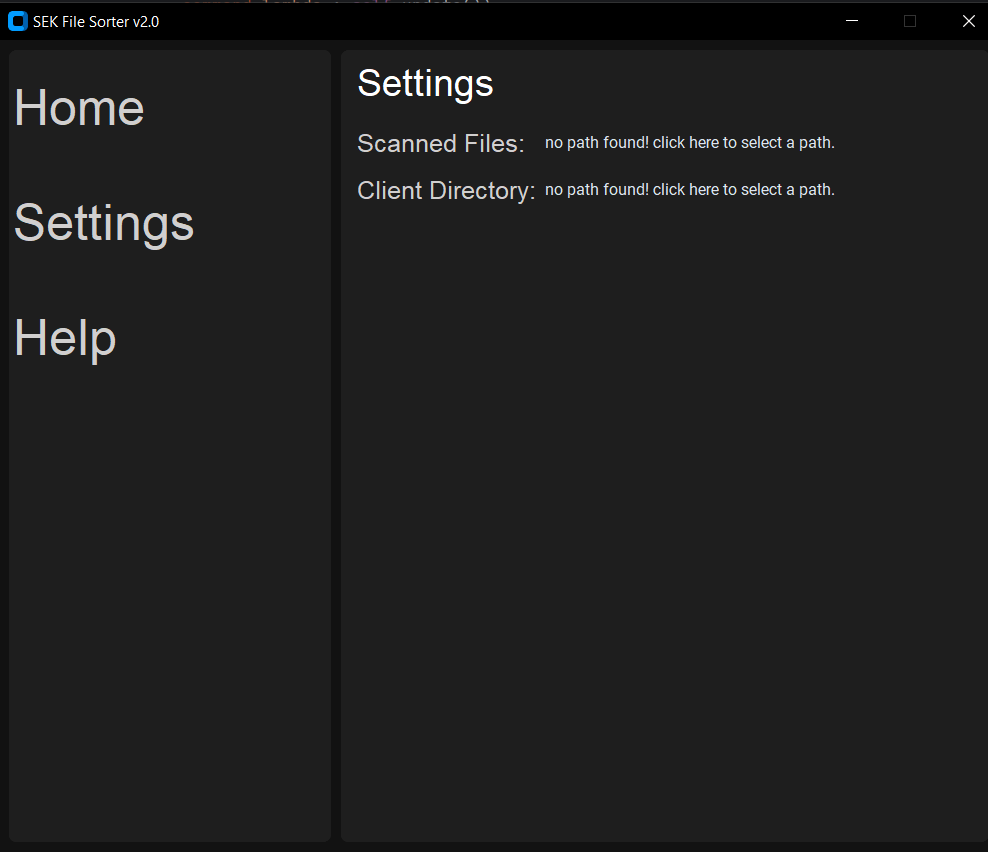
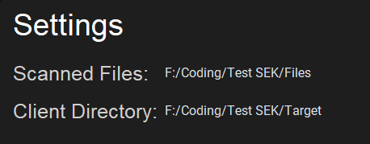
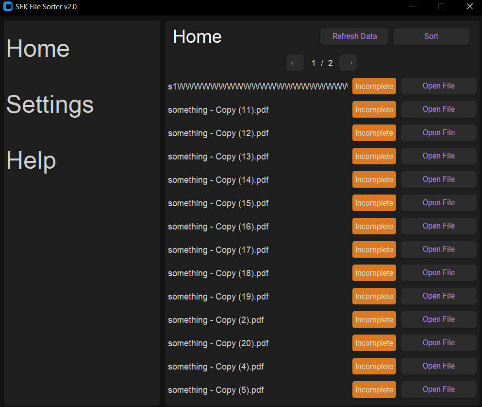
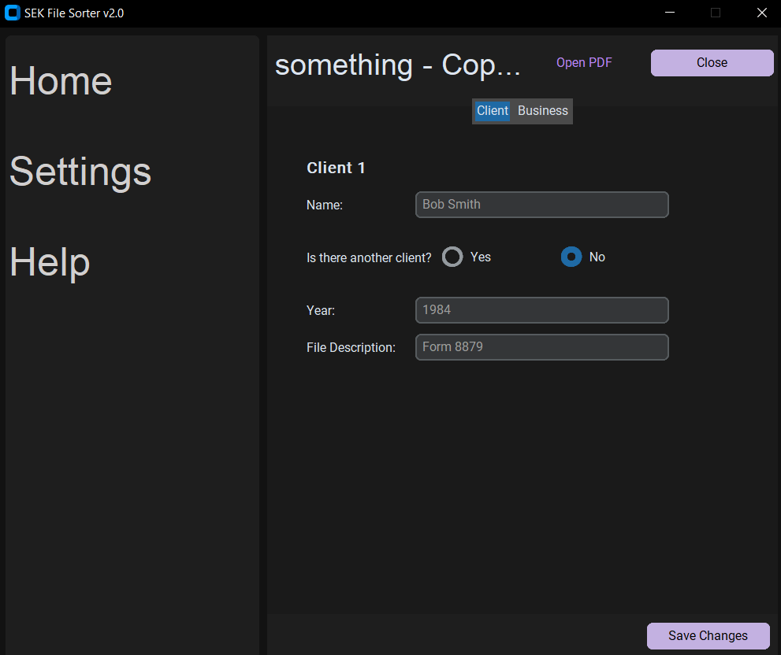
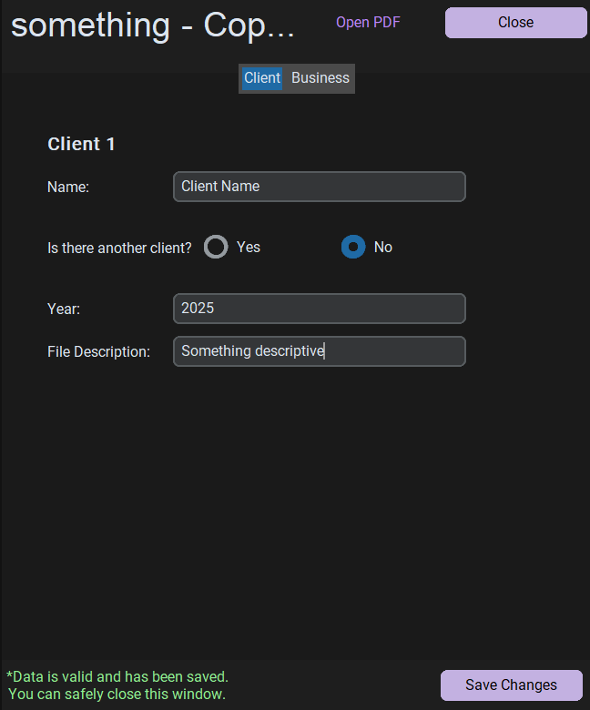
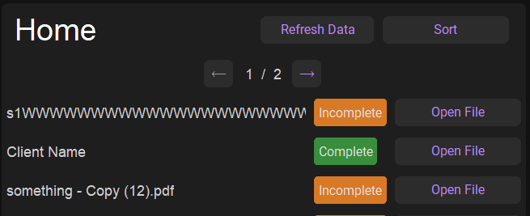
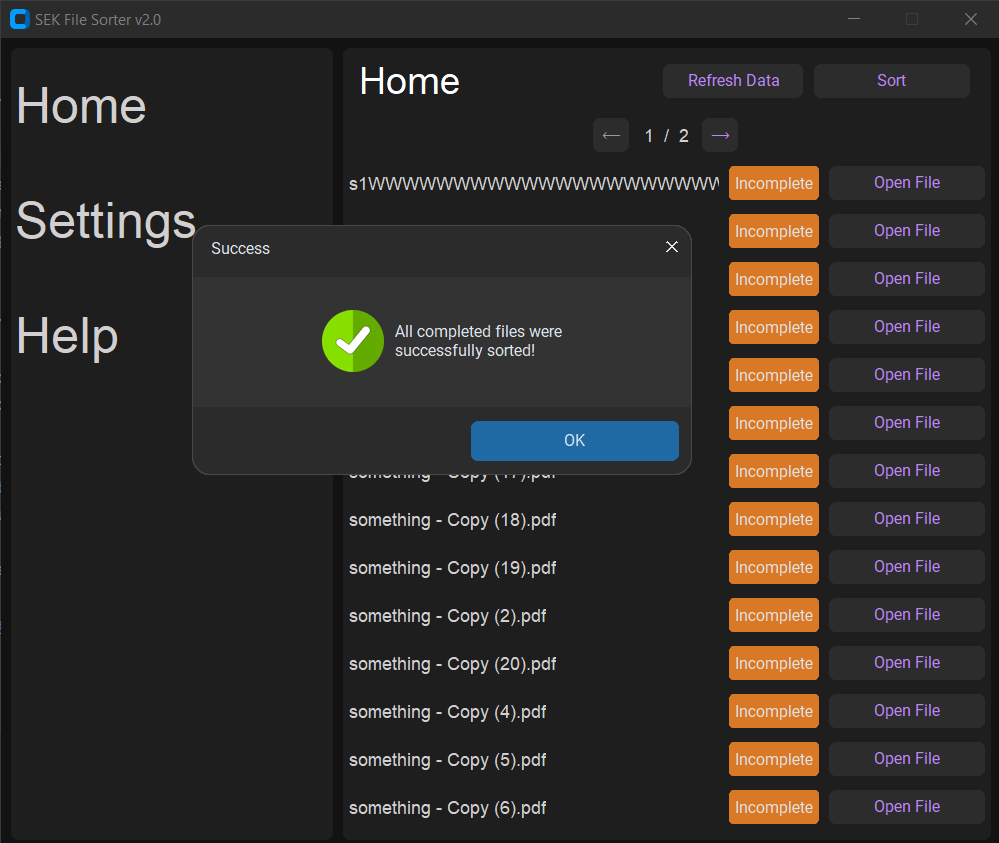

# SEK File Sorter

*This tool was initially developed in 2024 to improve data workflows in my role as a Data Entry Specialist. This public repo was created recently to share a cleaned, refactored version of the code as part of supporting additional businessness requirements. It contains no proprietary data, and it is shared here with permission from the company.*

## Installation

Download the latest release [**here**](https://github.com/scottfennell5/SEK-FileSorter-v2.0/releases/latest)

- The `.zip` file labeled **EXE** is a standalone version, simply unzip and run the exe file to start.
- Alternatively, you can download the **source code** for manual setup.

## Demo

  When opening the project for the first time, your home screen should look like this:
  

1. **Visit the 'Settings' Page**  
   Ensure the scanned and target directories are set correctly.  
     
   Once configured, the page should look something like this, with a file path at each section:  
   

2. **Navigate to the 'Home' Menu**  
   This displays the list of files pulled from the scanned directory.
   Each file will show a status: `Incomplete` or `Complete`.  
   - **Incomplete** means more data needs to be entered.  
   - **Complete** means the file is ready to be sorted.
   

4. **Enter data for a file**  
   Click the `Open File` button on a file to begin editing:  
     
   After submitting the necessary data by clicking 'Save':  
     
   you can safely return to the home page.

5. **Return to 'Home' Menu**  
   You’ll now see the files you modified marked as either `Complete` or `Incomplete`. If any modified file is `Incomplete`, check that the filled in data matches the formatting requirements.  
   

6. **Press the 'Sort' Button**  
   This will move all files marked `Complete` to the target directory in their associated folder.  
   - If a client directory does not exist, it will be created automatically.  
   
